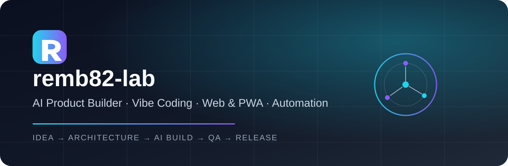

<div align="center">



<br />

Строю реальные цифровые продукты с помощью AI — от идеи, UX/UI и архитектуры до рабочего приложения, автоматизации и релиза.

</div>

---

## 🚀 Что я создаю

- 🏭 **AI Software Factory** — система разработки ПО с AI-агентами и автоматизированными workflow.
- 🍳 **Home Kitchen** — экосистема для домашней кухни: хозяйское и клиентское приложения, каталог, заказы, PWA и автоматизация.
- 🎮 **TikGame Engine** — платформа интерактивных игр и live-механик.
- 🤖 **AI Automation** — агенты, GitHub Actions, автоматизация разработки и рабочих процессов.

## 🛠 Технологии и инструменты


## 📌 Публичные проекты

### 🍳 [Home Kitchen Client](https://github.com/remb82-lab/Home-Kitchen-Client)
Клиентское приложение Home Kitchen: каталог продукции, мобильный UX, PWA и работа с заказами.

## ❤️ Support open demos & experiments

Если мои открытые демо, AI-эксперименты и инструменты оказались полезны, вы можете поддержать их развитие.

[](https://app.binance.com/uni-qr/request-to-pay?billOrderId=451479147482447872&billType=request_a_payment)
[](./SUPPORT.md)

> Support helps me publish more open demos, experiments and practical AI products.

## ⚙️ Как я работаю

```text
IDEA → UX/UI → ARCHITECTURE → AI BUILD → QA → RELEASE
```

Мой подход — использовать AI не только для генерации кода, а как полноценную производственную систему: планирование, разработка, проверка, исправления и выпуск продукта.

---

<div align="center">

### Build → Test → Ship.

[](https://github.com/remb82-lab)

</div>
